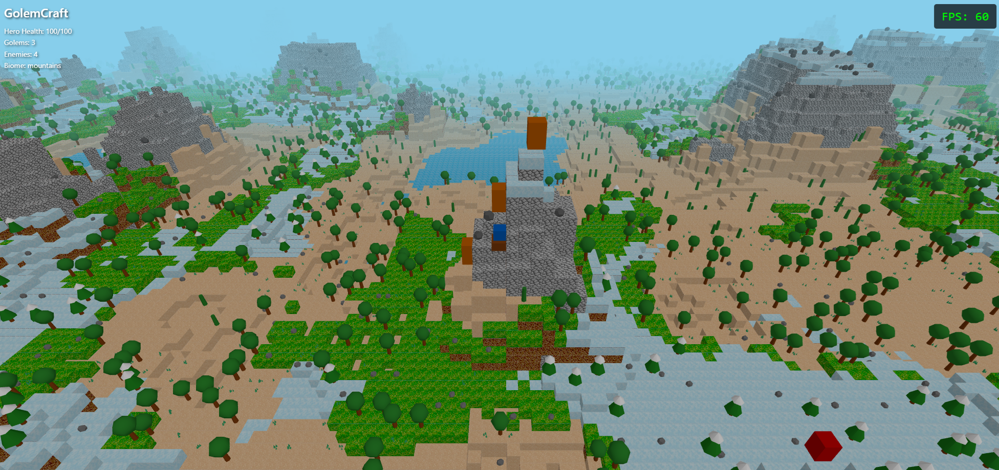

# GolemCraft

A browser-based 3D game blending MOBA and RTS elements with voxel aesthetics. Players control heroes riding mounts with tank-style controls, commanding AI golems in strategic combat.



## Features

- **Procedural Terrain Generation**: Multiple biomes including plains, desert, snowy plains, mountains, and ocean
- **Hero + Mount System**: Tank-style movement controls with hero commanding golems
- **Strategic Combat**: Command golems to attack enemies and defend positions
- **Voxel Aesthetics**: Block rendering with custom textures
- **Performance Optimized**: Surface-only block rendering for 40-60% fewer rendered blocks
- **Environmental Objects**: Trees, rocks, cacti, and grass generated per biome

## Tech Stack

- **Three.js** - 3D rendering engine
- **Vite** - Build tool and dev server
- **Vanilla JavaScript** - No frameworks, pure ES6 modules

## Project Structure

```
golemcraft/
├── src/
│   ├── main.js           # Entry point
│   ├── game.js           # Main game class and loop
│   ├── terrain.js        # Procedural terrain generation
│   ├── objects.js        # Environmental object generation
│   ├── entities.js       # Hero, Golem, and Enemy classes
│   └── utils/
│       └── fps-counter.js # Performance monitoring
├── public/
│   └── terrain3.png      # Texture atlas
├── index.html            # HTML entry point
├── package.json
└── README.md
```

## Getting Started

### Prerequisites

- Node.js 18+ and npm

### Installation

```bash
# Clone the repository
git clone https://github.com/yourusername/minecraft-moba-game.git
cd golemcraft

# Install dependencies
npm install

# Start development server
npm run dev
```

The game will be available at `http://localhost:5173`

### Building for Production

```bash
# Build optimized production bundle
npm run build

# Preview production build
npm run preview
```

## Controls

- **W** - Move forward
- **S** - Move backward
- **A** - Turn left
- **D** - Turn right
- **Space** - Jump
- **Mouse** - Rotate camera
- **Scroll** - Zoom in/out
- **Click** - Command golems to target location

## Performance

The game uses several optimization techniques:

- **Surface-only block rendering** - Only renders blocks with exposed faces (40-60% reduction)
- **Instanced mesh rendering** - Efficient GPU rendering of thousands of blocks
- **Procedural generation** - Terrain and objects generated on-the-fly
- **Fog-based culling** - Distant objects fade out

Typical performance: 60 FPS on modern desktop, 30-60 FPS on laptops

## Development Roadmap

- [ ] Implement three hero archetypes (tank, assassin, summoner)
- [ ] Add rally/banner system for commanding golems
- [ ] Expand biome variety and terrain features
- [ ] Implement three-phase match structure (early/mid/late game)
- [ ] Add hero abilities and unit interactions
- [ ] Mobile device optimization and touch controls

## Contributing

This is a personal project developed collaboratively with my child. Feel free to fork and experiment!

## License

MIT License - See LICENSE file for details

## Acknowledgments

- Minecraft textures inspire the visual style
- Three.js community for excellent documentation
- Inspired by MOBA and RTS game mechanics
